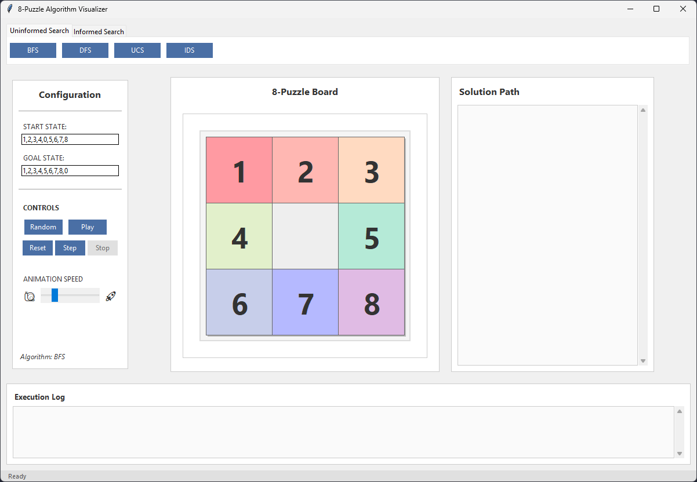

# 8-Puzzle Visualizer

## Introduction

The **8-Puzzle Visualizer** is a Python-based application that demonstrates various Artificial Intelligence (AI) search algorithms for solving the classic 8-puzzle problem. This program provides an interactive graphical user interface (GUI) to visualize how different algorithms explore and solve the puzzle. It supports uninformed search, informed search, local search strategies, and AND-OR search.

## Features

- **Algorithms Supported**:
  - Uninformed Search:
    - Breadth-First Search (BFS)
    - Depth-First Search (DFS)
    - Uniform Cost Search (UCS)
    - Iterative Deepening Search (IDS)
  - Informed Search:
    - Greedy Best-First Search
    - A\* Search
    - Iterative Deepening A* (IDA*)
    - Beam Search
  - Local Search:
    - Hill Climbing Variants:
      - Simple Hill Climbing
      - Stochastic Hill Climbing
    - Simulated Annealing
  - Non-deterministic Search:
    - AND-OR Search Algorithm
- **GUI Features**:
  - Modern, user-friendly interface built with `Tkinter`.
  - Visualization of puzzle states and transitions.
  - Animation of solution steps.
  - Adjustable animation speed.
  - Randomized start state generation.
  - Step-by-step execution of solutions.
  - Execution log and solution path display.

---

## Table of Contents

1. [Prerequisites](#prerequisites)
2. [Installation](#installation)
3. [Usage](#usage)
4. [Project Structure](#project-structure)
5. [How to Contribute](#how-to-contribute)
6. [License](#license)

---

## Prerequisites

To run this project, you need:

- Python 3.8 or later.
- Required Python libraries:
  - `tkinter` (comes pre-installed with Python).
  - `heapq`, `collections`, `math`, and `random` (standard Python libraries).

---

## Installation

1. Clone the repository or download the source files:

```bash
git clone https://github.com/1440isme/8-PuzzleAlgorithmVisualizer.git
cd 8-PuzzleAlgorithmVisualizer
```

2. Install required dependencies using `pip`:

```bash
pip install -r requirements.txt
```

_(Note: If no `requirements.txt` is provided, ensure Python's standard libraries are available.)_ 3. Run the application:

```bash
python main.py
```

---

## Usage

### Running the Application

1. Launch the program by running `main.py`:

```bash
python main.py
```

2. The GUI will open with the following sections:
   - **Algorithm Selection**: Choose an algorithm from the tabs (`Uninformed Search` or `Informed Search`).
   - **Configuration Panel**: Set the start and goal states or generate a random start state.
   - **Puzzle Board**: Displays the current state of the puzzle.
   - **Controls**: Solve, step through, reset, or stop animations.
   - **Execution Log**: View algorithm progress and results.

### How to Solve a Puzzle

1. Enter a valid start state and goal state in the configuration panel (e.g., `1,2,3,4,0,5,6,7,8`).
2. Select an algorithm from the tabs.
3. Click **Play** to solve the puzzle or **Step** to execute one step at a time.
4. Adjust animation speed using the slider.

### Randomize Start State

Click the **Random** button to generate a random solvable start state that matches the parity of the goal state.

---

## Project Structure

```
8-puzzle-visualizer/
├── Algorithms/
│   ├── uninformed.py       # Uninformed search algorithms (BFS, DFS, UCS, IDS).
│   ├── informed.py         # Informed search algorithms (A*, Greedy, etc.).
|   ├── local_search.py     # Local search algorithms (Hill Climbing, Simulated Annealing,.. )
|   ├── and_or_search.py    # AND-OR search algorithms (AND-OR graph search,...)
├── GUI/
│   ├── visualizer.py       # Main GUI logic for visualization.
├── Models/
│   ├── puzzle.py           # Puzzle model and utility functions.
├── main.py                 # Entry point for running the application.
└── README.md               # Documentation file.
```

### Key Files

1. **`uninformed.py`**: Implements BFS, DFS, UCS, and IDS algorithms.
2. **`informed.py`**: Implements heuristic-based algorithms like A\*, Greedy, Hill Climbing variants, etc.
3. **`visualizer.py`**: Handles GUI design and user interaction for visualizing puzzle solutions.
4. **`puzzle.py`**: Defines the puzzle structure and utility functions like checking solvability.

---

## How to Contribute

We welcome contributions! To contribute:

1. Fork this repository.
2. Create a new branch for your feature/bugfix:

```bash
git checkout -b feature-name
```

3. Commit your changes and push them to your forked repository:

```bash
git commit -m "Add feature-name"
git push origin feature-name
```

4. Submit a pull request describing your changes.

---

## License

This project is licensed under the MIT License. See `LICENSE` for details.

---

## Screenshots

### Main Interface:



### Puzzle Animation:

Puzzle Animation Screenshot

---

Enjoy exploring AI search algorithms with this interactive visualizer! 🎉

<div>⁂</div>

[^1]: [uninformed.py](https://github.com/1440isme/8-PuzzleAlgorithmVisualizer/blob/main/Algorithms/uninformed.py)
[^2]: [informed.py](https://github.com/1440isme/8-PuzzleAlgorithmVisualizer/blob/main/Algorithms/informed.py)
[^3]: [visualizer.py](https://github.com/1440isme/8-PuzzleAlgorithmVisualizer/blob/main/GUI/visualizer.py)
[^4]: [puzzle.py](https://github.com/1440isme/8-PuzzleAlgorithmVisualizer/blob/main/Models/puzzle.py)
[^5]: [main.py](https://github.com/1440isme/8-PuzzleAlgorithmVisualizer/blob/main/main.py)
