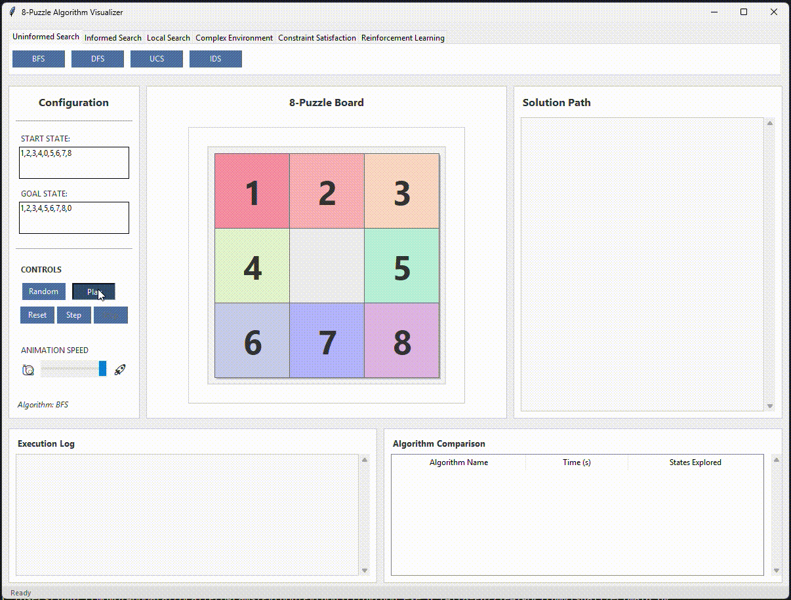
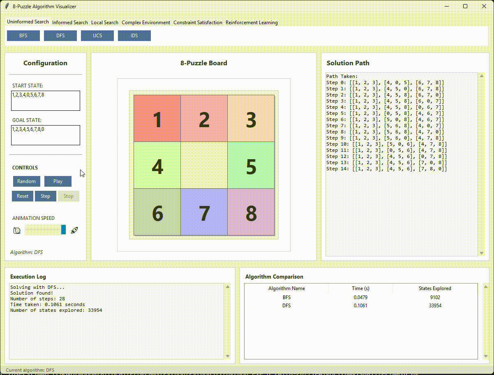
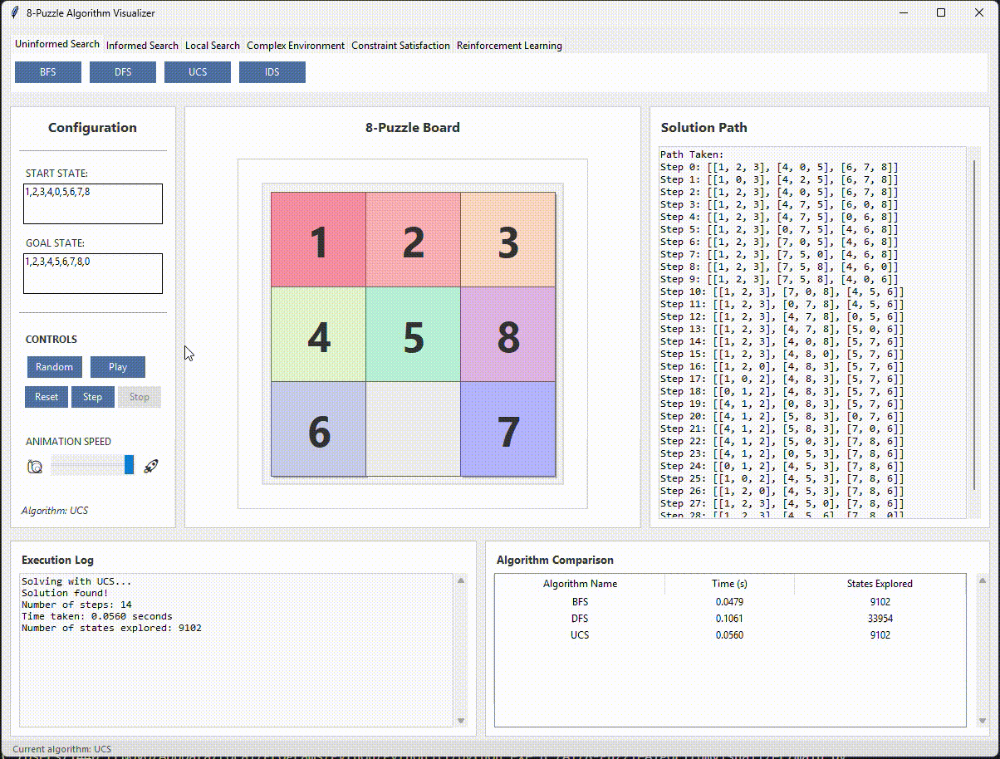

# Giải Bài Toán 8-Puzzle với Các Thuật Toán Trí Tuệ Nhân Tạo

## 1. Mục tiêu

### 1.1 Giải quyết bài toán 8-Puzzle
Sử dụng các thuật toán trí tuệ nhân tạo (AI) để tìm lời giải cho bài toán 8-Puzzle, một bài toán cổ điển trong lĩnh vực AI và khoa học máy tính.

### 1.2 Minh họa trực quan
Tạo một công cụ trực quan hóa (visualizer) để người dùng có thể quan sát quá trình các thuật toán giải bài toán một cách sinh động và dễ hiểu.

### 1.3 Khám phá và so sánh các thuật toán AI
- Cung cấp nhiều thuật toán khác nhau, bao gồm:
  - Thuật toán tìm kiếm (ví dụ: Backtracking, A*, Hill Climbing, etc.).
  - Thuật toán học tăng cường (Reinforcement Learning).
  - Thuật toán trong môi trường có ràng buộc hoặc môi trường phức tạp.
- So sánh hiệu suất của các thuật toán trong việc giải bài toán 8-Puzzle.

### 1.4 Học tập và nghiên cứu
- Hỗ trợ người học và nhà phát triển nghiên cứu các kỹ thuật giải bài toán AI thông qua việc cung cấp mã nguồn Python rõ ràng, dễ hiểu.
- Khuyến khích khám phá các cách tiếp cận khác nhau để giải quyết vấn đề.

### 1.5 Tương tác với người dùng
Sử dụng giao diện Tkinter để cung cấp trải nghiệm tương tác, cho phép người dùng nhập trạng thái ban đầu và mục tiêu, sau đó quan sát cách thuật toán hoạt động.

## 2. Nội dung

### 2.1 Các thuật toán Tìm kiếm không có thông tin

#### Thành phần chính của bài toán tìm kiếm
1. **Trạng thái ban đầu (Initial State):**
   - Puzzle 3x3 với các số (0-8) là đầu vào (start) do người dùng nhập (có ràng buộc hợp lệ).
2. **Trạng thái mục tiêu (Goal State):**
   - Trạng thái cuối cùng mà bài toán yêu cầu tìm ra: là mục tiêu (goal) do người dùng nhập.
3. **Không gian trạng thái (State Space):**
   - Bao gồm tất cả các trạng thái có thể từ trạng thái ban đầu đến trạng thái mục tiêu.
4. **Tập hợp các hành động (Actions):**
   - Các hành động có thể thực hiện trên trạng thái hiện tại để chuyển sang trạng thái mới. Cụ thể trong 8-Puzzle, các hành động là di chuyển ô trống lên, xuống, trái, hoặc phải.
5. **Hàm chuyển đổi (Transition Function):**
   - Hàm xác định trạng thái mới sau khi thực hiện một hành động cụ thể từ trạng thái hiện tại. Nguyên lý hoạt động của hàm chuyển đổi (dfs_recursion trong dfs và dls trong ids):
     - **Xác định vị trí ô trống (blank):** blank_i, blank_j để tìm tọa độ cần di chuyển.
     - **Danh sách các hành động (moves):** Mô tả cách di chuyển ô trống (lên, xuống, trái, phải).
     - **Kiểm tra điều kiện hợp lệ:** Đảm bảo tọa độ mới nằm trong giới hạn puzzle.
     - **Hoán đổi ô trống với ô liền kề:** Dùng phép gán để thay đổi trạng thái.
     - **Chuyển trạng thái về dạng tuple:** Chuyển đổi trạng thái từ danh sách sang tuple để có thể thêm vào tập visited.
6. **Hàm chi phí (Cost Function):**
   - Được áp dụng trong hàm UCS và được biểu diễn bằng cách tăng dần chi phí mỗi khi chuyển đổi trạng thái (cost + 1).

#### Thuật toán và cách tiếp cận solution
1. **BFS (Breadth-First Search):**
   - Sử dụng hàng đợi FIFO để duyệt qua tất cả trạng thái theo chiều rộng.
   - Kết quả trả về là đường đi từ trạng thái ban đầu đến trạng thái mục tiêu, đồng thời đếm số trạng thái đã duyệt qua.
   
2. **DFS (Depth-First Search):**
   - Sử dụng đệ quy để duyệt qua không gian trạng thái theo chiều sâu.
   - Có giới hạn độ sâu tối đa để tránh vòng lặp vô hạn.
   
3. **UCS (Uniform-Cost Search):**
   - Là thuật toán BFS nhưng có thêm chi phí để mở rộng trạng thái. Sử dụng hàng đợi ưu tiên (priority queue) để chọn trạng thái có chi phí thấp nhất.
   
4. **IDS (Iterative Deepening Search):**
   - Kết hợp DFS và BFS bằng cách tăng dần độ sâu giới hạn cho DFS. Điều này cho phép tìm kiếm theo chiều sâu nhưng vẫn đảm bảo tìm được giải pháp tối ưu.

#### Solution
- **Solution** là một đường đi từ trạng thái ban đầu đến trạng thái mục tiêu, được biểu diễn dưới dạng một danh sách các trạng thái và các hành động tương ứng. Trong mỗi thuật toán, nếu tìm thấy trạng thái mục tiêu, kết quả trả về sẽ bao gồm đường đi và số trạng thái đã duyệt qua. Nếu không tìm thấy, kết quả sẽ là danh sách rỗng.

#### Nhận xét
- Nếu cần **đảm bảo tối ưu lời giải** và không bị giới hạn tài nguyên bộ nhớ, **BFS** hoặc **UCS** là lựa chọn phù hợp. Tuy nhiên, bộ nhớ cao có thể là vấn đề lớn.
- **IDS** là lựa chọn thay thế tốt nhất khi bộ nhớ hạn chế mà vẫn cần lời giải tối ưu. Dù vậy, thời gian chạy có thể lâu hơn.
- **DFS** chỉ nên sử dụng khi cần tìm lời giải nhanh mà không yêu cầu tối ưu, hoặc khi bài toán nhỏ và không gian trạng thái hạn chế.

### 2.2 Các thuật toán Tìm kiếm có thông tin

#### Thành phần chính của bài toán tìm kiếm
1. **Trạng thái ban đầu (Initial State):**
   - Puzzle 3x3 với các số (0-8) là đầu vào (start) do người dùng nhập (có ràng buộc hợp lệ).
2. **Trạng thái mục tiêu (Goal State):**
   - Trạng thái cuối cùng mà bài toán yêu cầu tìm ra: là mục tiêu (goal) do người dùng nhập.
3. **Không gian trạng thái (State Space):**
   - Bao gồm tất cả các trạng thái có thể từ trạng thái ban đầu đến trạng thái mục tiêu.
4. **Tập hợp các hành động (Actions):**
   - Các hành động có thể thực hiện trên trạng thái hiện tại để chuyển sang trạng thái mới. Cụ thể trong 8-Puzzle, các hành động là di chuyển ô trống lên, xuống, trái, hoặc phải.
5. **Hàm chuyển đổi (Transition Function):**
   - Hàm xác định trạng thái mới sau khi thực hiện một hành động cụ thể từ trạng thái hiện tại. Nguyên lý hoạt động của hàm chuyển đổi (dfs_recursion trong dfs và dls trong ids):
     - **Xác định vị trí ô trống (blank):** blank_i, blank_j để tìm tọa độ cần di chuyển.
     - **Danh sách các hành động (moves):** Mô tả cách di chuyển ô trống (lên, xuống, trái, phải).
     - **Kiểm tra điều kiện hợp lệ:** Đảm bảo tọa độ mới nằm trong giới hạn puzzle.
     - **Hoán đổi ô trống với ô liền kề:** Dùng phép gán để thay đổi trạng thái.
     - **Chuyển trạng thái về dạng tuple:** Chuyển đổi trạng thái từ danh sách sang tuple để có thể thêm vào tập visited.
6. **Hàm chi phí (Cost Function):**
   - Trong các thuật toán trong nhóm, hàm chi phí được biểu diễn bằng cách tăng dần chi phí mỗi khi chuyển đổi trạng thái (cost + 1).
7. **Hàm heuristic (Heuristic Function):**
   - Hàm đánh giá, cung cấp thông tin bổ sung để ước tính "độ gần" từ trạng thái hiện tại đến trạng thái mục tiêu. Trong nhóm này, hàm **Manhattan Distance** được sử dụng làm heuristic.

#### Thuật toán và cách tiếp cận solution
1. **Greedy Search:**
   - Chỉ sử dụng giá trị heuristic để quyết định trạng thái nào sẽ được mở rộng tiếp theo.
   - Hàng đợi ưu tiên (priority queue) được sử dụng để lưu trữ các trạng thái, với độ ưu tiên dựa trên giá trị heuristic.
2. **A* Search:**
   - Kết hợp chi phí đã đi qua (`g`) và giá trị heuristic (`h`) để tính tổng chi phí dự đoán (`f = g + h`).
   - Hàng đợi ưu tiên được sử dụng để mở rộng trạng thái có giá trị `f` thấp nhất.
3. **IDA* Search (Iterative Deepening A*):**
   - Một phiên bản cải tiến của A*, sử dụng giá trị `f` làm giới hạn ngắt (threshold) và tìm kiếm theo chiều sâu (DFS) với giới hạn tăng dần.

#### Solution
- **Solution** là một đường đi từ trạng thái ban đầu đến trạng thái mục tiêu, được biểu diễn dưới dạng một danh sách các trạng thái và các hành động tương ứng. Trong mỗi thuật toán, nếu tìm thấy trạng thái mục tiêu, kết quả trả về sẽ bao gồm đường đi và số trạng thái đã duyệt qua. Nếu không tìm thấy, kết quả sẽ là danh sách rỗng.

#### Nhận xét
- Nếu bộ nhớ không bị giới hạn, **A*** là lựa chọn ưu tiên để giải bài toán 8-puzzle vì vừa đảm bảo tối ưu, vừa tận dụng heuristic để tăng tốc độ tìm kiếm.
- Khi bộ nhớ hạn chế, **IDA*** là một giải pháp thay thế tốt, dù tốc độ chạy có thể chậm hơn.
- **Greedy Search** chỉ nên sử dụng khi không yêu cầu lời giải tối ưu hoặc cần tìm kiếm nhanh với tài nguyên hạn chế.

### 2.3 Các thuật toán Tìm kiếm cục bộ

#### Thành phần chính của bài toán
1. **Trạng thái ban đầu (Initial State):**
   - Puzzle 3x3 với các số (0-8) là đầu vào (start) do người dùng nhập (có ràng buộc hợp lệ).
2. **Trạng thái mục tiêu (Goal State):**
   - Trạng thái cuối cùng mà bài toán yêu cầu tìm ra: là mục tiêu (goal) do người dùng nhập.
3. **Không gian trạng thái (State Space):**
   - Bao gồm tất cả các trạng thái có thể từ trạng thái ban đầu đến trạng thái mục tiêu, được sinh ra bằng cách thực hiện các hành động hợp lệ từ trạng thái hiện tại.
4. **Tập hợp các hành động (Actions):**
   - Các hành động có thể thực hiện trên trạng thái hiện tại để chuyển sang trạng thái mới. Cụ thể trong 8-Puzzle, các hành động là di chuyển ô trống lên, xuống, trái, hoặc phải.
5. **Hàm chuyển đổi (Transition Function):**
   - Hàm xác định trạng thái mới sau khi thực hiện một hành động cụ thể từ trạng thái hiện tại. Nguyên lý hoạt động của hàm chuyển đổi:
     - **Xác định vị trí ô trống (blank):** blank_i, blank_j để tìm tọa độ cần di chuyển.
     - **Danh sách các hành động (moves):** Mô tả cách di chuyển ô trống (lên, xuống, trái, phải).
     - **Kiểm tra điều kiện hợp lệ:** Đảm bảo tọa độ mới nằm trong giới hạn puzzle.
     - **Hoán đổi ô trống với ô liền kề:** Dùng phép gán để thay đổi trạng thái.
     - **Chuyển trạng thái về dạng tuple:** Chuyển đổi trạng thái từ danh sách sang tuple để có thể thêm vào tập visited.
6. **Hàm đánh giá hoặc fitness (Evaluation/Fitness Function):**
   - Hàm này được dùng để đánh giá "độ tốt" của một trạng thái:
     - **Manhattan Distance:** Tổng khoảng cách Manhattan giữa các ô số từ vị trí hiện tại đến vị trí mục tiêu.
     - **Fitness Function (Genetic Algorithm):** Là nghịch đảo của Manhattan Distance: fitness = 1 / (1 + distance).
7. **Hàm nhiệt độ (Simulated Annealing):**
   - Hàm nhiệt độ giảm dần theo thời gian, quyết định xác suất chấp nhận các trạng thái kém hơn trong thuật toán Simulated Annealing (xác suất được tính bằng công thức e^(-deltaE / T)).

#### Thuật toán và cách tiếp cận solution
1. **Hill Climbing:**
   - Luôn chọn trạng thái lân cận có heuristic tốt nhất so với trạng thái hiện tại.
   - Dễ rơi vào cực tiểu cục bộ (local minima).
2. **Steepest Ascent Hill Climbing:**
   - Xét tất cả các trạng thái lân cận và chọn trạng thái có heuristic tốt nhất.
   - Tăng khả năng tìm được trạng thái tốt hơn so với Hill Climbing thông thường.
3. **Stochastic Hill Climbing:**
   - Chọn ngẫu nhiên một trạng thái lân cận tốt hơn, thay vì chọn trạng thái tốt nhất.
   - Giảm nguy cơ bị mắc kẹt trong cực tiểu địa phương.
4. **Simulated Annealing:**
   - Cho phép chuyển sang trạng thái "kém hơn" với xác suất giảm dần theo nhiệt độ (temperature).
   - Giảm nguy cơ rơi vào cực tiểu địa phương.
5. **Beam Search:**
   - Duy trì một số lượng giới hạn các trạng thái tốt nhất (beam width) tại mỗi bước.
   - Tiết kiệm bộ nhớ nhưng có thể bỏ qua trạng thái dẫn đến lời giải.
6. **Genetic Algorithm:**
   - Tạo ra một quần thể các trạng thái ban đầu, sau đó duyệt qua nhiều thế hệ để tối ưu hóa dựa trên phép lai và đột biến.
   - Có khả năng khám phá rộng rãi không gian trạng thái nhưng không đảm bảo lời giải tối ưu trong số lượng thế hệ hạn chế.

#### Solution
- **Solution** là một đường đi từ trạng thái ban đầu đến trạng thái mục tiêu, được biểu diễn dưới dạng một danh sách các trạng thái và các hành động tương ứng. Trong mỗi thuật toán, nếu tìm thấy trạng thái mục tiêu, kết quả trả về sẽ bao gồm đường đi và số trạng thái đã duyệt qua. Nếu không tìm thấy, kết quả sẽ là danh sách rỗng.

#### Nhận xét
- **Simulated Annealing** và **Genetic Algorithm** là hai thuật toán phù hợp nhất để giải bài toán 8-puzzle trong nhóm tìm kiếm cục bộ, nhờ khả năng thoát khỏi cực tiểu địa phương.
- **Hill Climbing** và **Steepest Ascent Hill Climbing** phù hợp với các bài toán nhỏ hoặc không gian trạng thái đơn giản, nhưng không hiệu quả với bài toán 8-puzzle do dễ rơi vào cực tiểu.
- **Beam Search** có thể hiệu quả nếu chọn beam width phù hợp, nhưng vẫn không đảm bảo tìm được lời giải.

### 2.4 Các thuật toán Tìm kiếm trong môi trường phức tạp

#### Thành phần chính của bài toán tìm kiếm
1. **Trạng thái ban đầu (Initial State):**
   - Puzzle 3x3 với các số (0-8) là đầu vào (start) do người dùng nhập (có ràng buộc hợp lệ).
   - Trong thuật toán mù (No Observation/Partially Observable), trạng thái ban đầu là một tập hợp các trạng thái khởi tạo (belief states) với phân phối xác suất.
2. **Trạng thái mục tiêu (Goal State):**
   - Trạng thái cuối cùng mà bài toán yêu cầu tìm ra: là mục tiêu (goal) do người dùng nhập.
   - Trong No Observation/Partially Observable, trạng thái mục tiêu là tập hợp trạng thái với xác suất cao nhất nằm trong các trạng thái mục tiêu.
3. **Không gian trạng thái (State Space):**
   - Bao gồm tất cả các trạng thái có thể từ trạng thái ban đầu đến trạng thái mục tiêu.
   - Với bài toán không quan sát (No Observation) hoặc bài toán xác suất (Partially Observable), không gian trạng thái được mở rộng thành tập hợp các belief states (phân phối xác suất trên các trạng thái vật lý).
4. **Tập hợp các hành động (Actions):**
   - Các hành động có thể thực hiện trên trạng thái hiện tại để chuyển sang trạng thái mới. Trong bài toán 8-puzzle, các hành động là di chuyển ô trống: UP, DOWN, LEFT, RIGHT.
5. **Hàm chuyển đổi (Transition Function):**
   - Hàm xác định trạng thái mới sau khi thực hiện một hành động cụ thể từ trạng thái hiện tại.
   - Trong No Observation/Partially Observable, hàm chuyển đổi còn tạo ra phân phối xác suất trên các trạng thái tiếp theo.
6. **Hàm quan sát (Observation Function - áp dụng cho Partially Observable):**
   - Mô hình hóa khả năng nhận được quan sát từ trạng thái hiện tại. Quan sát có thể bị nhiễu dựa trên xác suất.
7. **Hàm thưởng (Reward Function - áp dụng cho Partially Observable):**
   - Trả về giá trị thưởng hoặc phạt khi đạt trạng thái mục tiêu hoặc các trạng thái khác.
8. **Hàm heuristic (Heuristic Function):**
   - Được sử dụng để đánh giá "độ gần" từ trạng thái hiện tại đến trạng thái mục tiêu.
   - **Manhattan Distance**: Tổng khoảng cách Manhattan giữa các ô số từ vị trí hiện tại đến vị trí mục tiêu.
   - Trong bài toán No Observation/Partially Observable, heuristic được tính dựa trên trung bình khoảng cách Manhattan của các belief states.

#### Thuật toán và cách tiếp cận solution
1. **AND-OR Search:**
   - **Nguyên tắc hoạt động:**
     - Xử lý bài toán bằng cách kết hợp AND nodes và OR nodes.
     - OR nodes đại diện cho các hành động có thể thực hiện, AND nodes đại diện cho tập hợp trạng thái kết quả từ hành động.
   - **Ứng dụng:** Giải bài toán 8-puzzle trong môi trường chắc chắn (deterministic).
2. **Partially Observable:**
   - **Nguyên tắc hoạt động:**
     - Áp dụng A* Search trên belief states, tối ưu hóa hành động dựa trên phân phối xác suất của các trạng thái.
     - Tính toán xác suất chuyển trạng thái và quan sát để cập nhật belief state.
   - **Ứng dụng:** Giải bài toán 8-puzzle khi có nhiễu trong quan sát (nhìn thấy 1 phần).
3. **No Observation:**
   - **Nguyên tắc hoạt động:**
     - Áp dụng A* Search trên belief states mà không có thông tin quan sát.
     - Giải quyết bài toán bằng cách đảm bảo mọi trạng thái trong belief state đều đạt được trạng thái mục tiêu.
   - **Ứng dụng:** Giải bài toán 8-puzzle khi không có khả năng quan sát trạng thái.

#### Solution
- **Solution** là một đường đi từ trạng thái ban đầu đến trạng thái mục tiêu, được biểu diễn dưới dạng một danh sách các trạng thái và các hành động tương ứng. Trong mỗi thuật toán, nếu tìm thấy trạng thái mục tiêu, kết quả trả về sẽ bao gồm đường đi và số trạng thái đã duyệt qua. Nếu không tìm thấy, kết quả sẽ là danh sách rỗng.

#### Nhận xét
- **AND-OR Search** là lựa chọn phù hợp cho bài toán 8-puzzle trong môi trường chắc chắn, nơi không có nhiễu hoặc không có sự không chắc chắn trong trạng thái và hành động.
- **Partially Observable** hoạt động hiệu quả trong môi trường có nhiễu hoặc không chắc chắn, nhưng yêu cầu tài nguyên tính toán lớn và thời gian xử lý dài. Đây là lựa chọn tốt cho biến thể phức tạp của 8-puzzle.
- **No Observation** giải quyết bài toán trong môi trường hoàn toàn không có quan sát, nhưng hiệu suất giảm nhanh khi không gian trạng thái hoặc belief states tăng.

### 2.5 Tìm kiếm trong môi trường có ràng buộc

#### Thành phần chính của bài toán tìm kiếm
1. **Trạng thái ban đầu (Initial State):**
   - Với Trial and Error: Puzzle 3x3 với các số (0-8) là đầu vào (start) do người dùng nhập (có ràng buộc hợp lệ).
   - Với Backtracking CSP và Backtracking – AC3: Puzzle rỗng.
2. **Trạng thái mục tiêu (Goal State):**
   - Trạng thái cuối cùng mà bài toán yêu cầu tìm ra: là mục tiêu (goal) do người dùng nhập.
3. **Không gian trạng thái (State Space):**
   - Bao gồm tất cả các trạng thái có thể từ trạng thái ban đầu đến trạng thái mục tiêu.
   - Trong bài toán ràng buộc, không gian trạng thái được thu hẹp dựa trên các miền giá trị và ràng buộc áp đặt (ví dụ: All-Different, vị trí của ô trống,...).
4. **Tập hợp các hành động (Actions):**
   - Các hành động có thể thực hiện trên trạng thái hiện tại để chuyển sang trạng thái mới. Cụ thể trong 8-Puzzle, các hành động là di chuyển ô trống: UP, DOWN, LEFT, RIGHT.
5. **Hàm chuyển đổi (Transition Function):**
   - Hàm xác định trạng thái mới sau khi thực hiện một hành động cụ thể từ trạng thái hiện tại.
   - Trong **Backtracking**, hàm chuyển đổi bao gồm việc điền các số còn lại vào ô trống và kiểm tra tính hợp lệ.
   - Trong **AC-3**, hàm chuyển đổi thu hẹp miền giá trị dựa trên ràng buộc giữa các biến.
6. **Miền giá trị (Domains):**
   - Tập hợp các giá trị có thể gán cho mỗi biến (ô trong bảng). Ban đầu, miền giá trị là [0-8] cho tất cả các ô.
7. **Ràng buộc (Constraints):**
   - Các quy tắc hạn chế miền giá trị của các biến:
     - **All-Different:** Mỗi ô phải chứa một giá trị khác nhau.
     - **Vị trí cụ thể của ô trống:** Đảm bảo số 0 (ô trống) được đặt đúng vị trí trong trạng thái mục tiêu.
8. **Hàm heuristic (Heuristic Function):**
   - Được sử dụng để đánh giá "độ gần" từ trạng thái hiện tại đến trạng thái mục tiêu.
   - **Manhattan Distance:** Tổng khoảng cách Manhattan giữa các ô số từ vị trí hiện tại đến vị trí mục tiêu.

#### Thuật toán và cách tiếp cận solution
1. **Backtracking CSP:**
   - **Nguyên tắc hoạt động:**
     - Duyệt qua từng ô trong bảng và thử điền các số còn lại từ miền giá trị.
     - Quay lui nếu không tìm được lời giải khả thi.
     - Lưu trữ các bước để hiển thị quá trình tìm lời giải.
   - **Ứng dụng:** Giải bài toán ràng buộc đơn giản, không cần giảm miền giá trị.
2. **Backtracking AC-3:**
   - **Nguyên tắc hoạt động:**
     - Kết hợp AC-3 để thu hẹp miền giá trị trước khi thực hiện Backtracking.
   - **Ứng dụng:** Giải bài toán ràng buộc phức tạp, tối ưu hóa hiệu suất so với Backtracking thông thường.
3. **Trial and Error:**
   - **Nguyên tắc hoạt động:**
     - Thử nghiệm ngẫu nhiên các hành động và trạng thái lân cận.
     - Sử dụng heuristic (Manhattan Distance) để ưu tiên các trạng thái gần mục tiêu hơn.
   - **Ứng dụng:** Giải bài toán bằng cách thử nghiệm ngẫu nhiên, không đảm bảo tối ưu.

#### Solution
- **Solution** là một đường đi từ trạng thái ban đầu đến trạng thái mục tiêu, được biểu diễn dưới dạng một danh sách các trạng thái và các hành động tương ứng. Trong mỗi thuật toán, nếu tìm thấy trạng thái mục tiêu, kết quả trả về sẽ bao gồm đường đi và số trạng thái đã duyệt qua. Nếu không tìm thấy, kết quả sẽ là danh sách rỗng.

#### Nhận xét
- **Backtracking AC-3** là thuật toán hiệu quả nhất trong nhóm, đặc biệt khi giải bài toán 8-puzzle với trạng thái ban đầu phức tạp hoặc nhiều ràng buộc.
- **AC-3** đóng vai trò hỗ trợ mạnh mẽ, giúp giảm không gian tìm kiếm trước khi thực hiện Backtracking.
- **Trial and Error** phù hợp cho các bài toán đơn giản hoặc khi cần giải nhanh nhưng không đảm bảo tối ưu.
- **Backtracking CSP** minh họa tốt quá trình tìm kiếm nhưng không hiệu quả với bài toán lớn.

### 2.6 Tìm kiếm trong môi trường học tăng cường

#### Thành phần chính của bài toán tìm kiếm
1. **Trạng thái ban đầu (Initial State):**
   - Puzzle 3x3 với các số (0-8) là đầu vào (start) do người dùng nhập (có ràng buộc hợp lệ).
2. **Trạng thái mục tiêu (Goal State):**
   - Trạng thái cuối cùng mà bài toán yêu cầu tìm ra: là mục tiêu (goal) do người dùng nhập.
3. **Không gian trạng thái (State Space):**
   - Bao gồm tất cả các trạng thái có thể từ trạng thái ban đầu đến trạng thái mục tiêu, được sinh ra bằng việc thực hiện các hành động hợp lệ.
4. **Tập hợp các hành động (Actions):**
   - Các hành động có thể thực hiện trên trạng thái hiện tại để chuyển sang trạng thái mới. Trong 8-Puzzle, các hành động là di chuyển ô trống: UP, DOWN, LEFT, RIGHT.
5. **Hàm chuyển đổi (Transition Function):**
   - Trong Q-learning, hàm take_action thực hiện việc di chuyển ô trống và trả về trạng thái mới.
6. **Hàm thưởng (Reward Function):**
   - Trả về giá trị thưởng hoặc phạt khi đạt trạng thái mục tiêu hoặc trạng thái khác:
     - **Thưởng:** +100 nếu trạng thái mới là trạng thái mục tiêu.
     - **Phạt/Thưởng tương đối:** Dựa trên khoảng cách Manhattan giữa trạng thái hiện tại và trạng thái mới.
7. **Hàm Q-value (Q-Function):**
   - Lưu trữ giá trị kỳ vọng của việc thực hiện một hành động trong một trạng thái nhất định.
   - Q-value được cập nhật dựa trên công thức:
     ```
     Q[s][a] += α * (r + γ * max(Q[s'][a']) - Q[s][a])
     ```
     - α (alpha): Tốc độ học.
     - γ (gamma): Hệ số chiết khấu.
     - r: Thưởng nhận được.
     - max(Q[s'][a']): Giá trị Q lớn nhất có thể đạt được từ trạng thái tiếp theo.
8. **Chính sách hành động (Policy):**
   - Sử dụng epsilon-greedy để chọn hành động:
     - Với xác suất epsilon, chọn hành động ngẫu nhiên (khám phá).
     - Với xác suất 1 - epsilon, chọn hành động có Q-value lớn nhất (khai thác).
9. **Hàm heuristic (Heuristic Function):**
   - **Manhattan Distance:** Được sử dụng để đánh giá khoảng cách giữa trạng thái hiện tại và trạng thái mục tiêu, hỗ trợ việc tính toán thưởng.

#### Thuật toán và cách tiếp cận solution
1. **Q-Learning:**
   - **Nguyên tắc hoạt động:**
     - Sử dụng bảng Q (Q-table) để lưu trữ giá trị kỳ vọng của các hành động trong từng trạng thái.
     - Học giá trị Q bằng cách cải thiện dần dần qua các tập huấn luyện (episodes).
     - Cập nhật Q-value dựa trên phần thưởng nhận được sau mỗi hành động.
   - **Ứng dụng:** Giải bài toán 8-Puzzle bằng cách học từ môi trường mà không cần biết trước toàn bộ không gian trạng thái.

#### Solution
- **Solution** là một đường đi từ trạng thái ban đầu đến trạng thái mục tiêu, được biểu diễn dưới dạng một danh sách các trạng thái và các hành động tương ứng. Trong mỗi thuật toán, nếu tìm thấy trạng thái mục tiêu, kết quả trả về sẽ bao gồm đường đi và số trạng thái đã duyệt qua. Nếu không tìm thấy, kết quả sẽ là danh sách rỗng.

#### Nhận xét
- Q-Learning cung cấp giải pháp khả thi cho 8-puzzle, đặc biệt khi không biết trước không gian trạng thái.
- Tuy nhiên, so với các thuật toán tìm kiếm dựa trên heuristic như A*, thời gian hội tụ và hiệu quả có thể thấp hơn vì phải học từ đầu.
- Thích hợp khi cần một phương pháp học hỏi từ môi trường thay vì sử dụng giải thuật tìm kiếm cố định.

## 3. Kết luận
Dự án đã triển khai một loạt các thuật toán mạnh mẽ để giải bài toán 8-Puzzle. Các thuật toán bao gồm nhóm tìm kiếm truyền thống, nhóm học tăng cường, cũng như các thuật toán xử lý bài toán trong môi trường phức tạp và môi trường có ràng buộc. Kết quả thu được cho thấy các thuật toán này không chỉ giải quyết được bài toán mà còn cho phép so sánh hiệu suất của chúng dựa trên các tiêu chí như thời gian chạy, số bước cần thực hiện và tổng số trạng thái duyệt. Điều này cung cấp cái nhìn sâu sắc về ưu, nhược điểm của từng thuật toán trong các điều kiện cụ thể.

Một điểm sáng của dự án là việc phát triển giao diện trực quan hóa bằng Tkinter, cho phép người dùng quan sát trực tiếp cách các thuật toán giải bài toán. Visualizer hiển thị trạng thái ban đầu, các bước di chuyển trong quá trình thực hiện thuật toán, và trạng thái mục tiêu cuối cùng. Công cụ này không chỉ giúp minh họa rõ ràng cách hoạt động của các thuật toán mà còn mang lại trải nghiệm tương tác, cho phép người dùng nhập trạng thái ban đầu và trạng thái mục tiêu để kiểm tra.

Với giao diện trực quan và mã nguồn dễ hiểu, dự án trở thành một công cụ hỗ trợ học tập mạnh mẽ. Nó giúp người học hiểu rõ cách các thuật toán hoạt động thông qua sự kết hợp giữa lý thuyết và thực hành. Đồng thời, dự án cũng cung cấp dữ liệu thực nghiệm quý giá để phân tích và kiểm tra hiệu quả của các thuật toán trong các môi trường khác nhau.